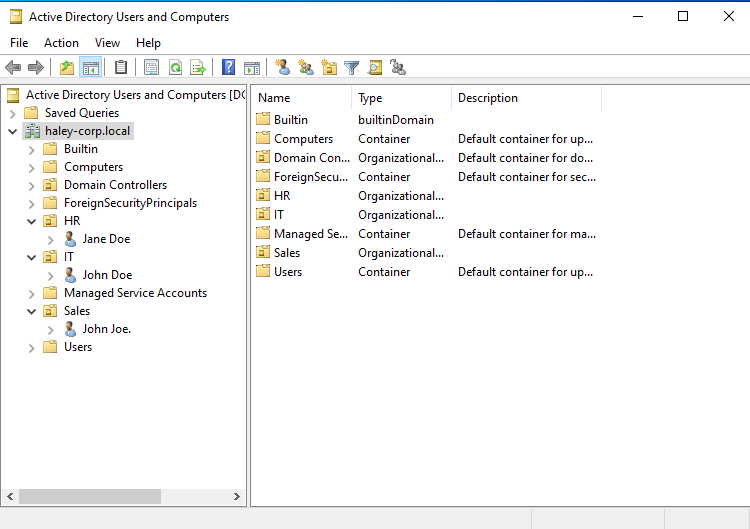
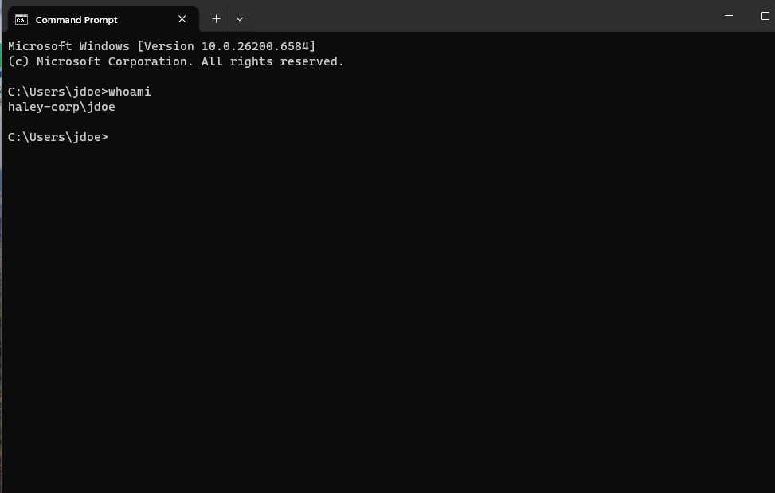
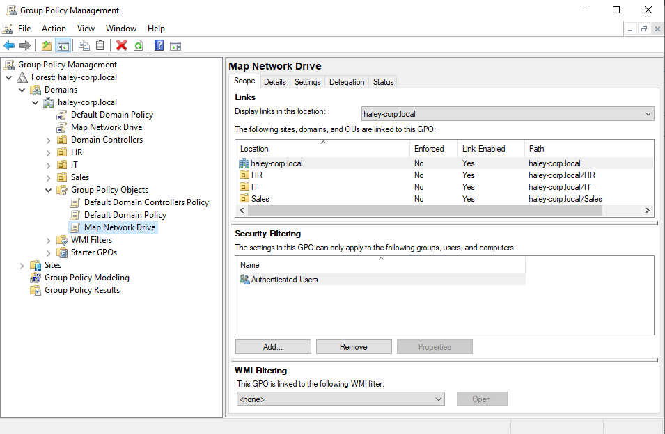

# Active Directory & Windows Server Home Lab

## Overview
This repository documents the deployment of an Active Directory Domain Services (AD DS) environment using Windows Server 2022 and Windows 11 client nodes hosted on VMware Workstation Pro.

## Infrastructure & Configuration
- **Domain Controller**: Windows Server 2022 (`DC-01`) | Static IP: `192.168.1.100`
- **Domain Name**: `haley-corp.local`
- **Client Workstation**: Windows 11 Enterprise (`Client-01`)

## Implementation Details

### 1. Active Directory OU & User Structure
Configured administrative Organizational Units (OUs) for enterprise divisions alongside user accounts and permissions.

### 2. Domain Authentication & Client Join
Joined `Client-01` to `haley-corp.local` via custom DNS configuration and validated domain-user logon.

### 3. Group Policy Configuration
Created and deployed Group Policy Objects (GPOs) to streamline workstation security settings and resource access.

## Issues Encountered & Solved
- **Issue**: Client VM failed to resolve the domain name during domain join.
- **Troubleshooting**: Verified physical connectivity, then identified that `Client-01` was using automatic DHCP DNS addresses.
- **Resolution**: Updated the IPv4 primary DNS on `Client-01` to point directly to the static IP of `DC-01` (`192.168.1.100`), resolving the domain join error immediately.
